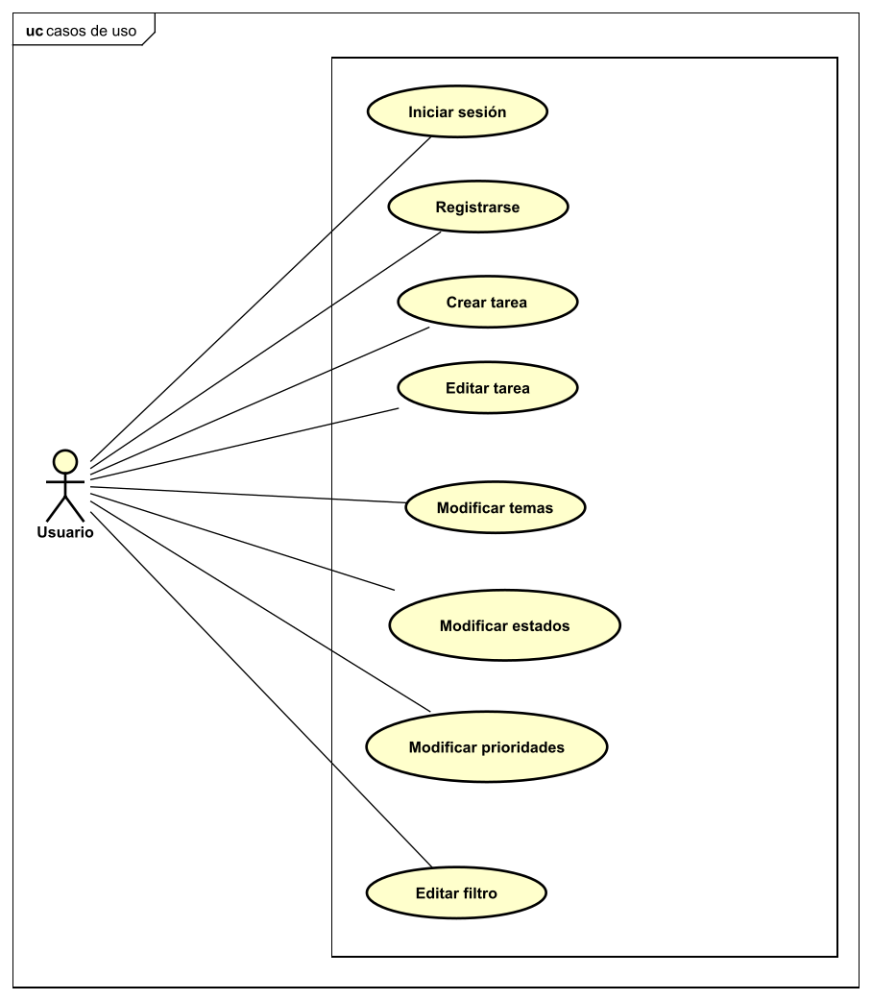

<h1>Documento resumen del proyecto para crear la aplicación "Tasketizer"</h1>

<ol>
<h2><li>Resumen del proyecto</li></h2>

Esta aplicación servirá para gestionar tareas. Las tareas tienen un título, una descripción, una fecha límite, un estado, un tema y una prioridad. El usuario podrá ver sus tareas agrupadas por los temas, estado o prioridades que tenga definidos. Por defecto, al registrarse los temas definidos son trabajo, tiempo libre y casa. Los estados definidos por defecto con pendiente, en ejecucción y finalizada. Las prioridades definidas por defecto son alta, media y baja. El usuario puede editar estos temas, estados y proridades definidas por defecto, eliminando cualquiera de ellos o cambiando su nombre. Además el usuario puede editar como se agrupan las tareas en la pantalla principal, agrupandose por los diferentes estados, temas o prioridades. El usuario puede crear tareas y editar los campos de una tarea ya creada, además de ver los detalles de la tarea. 

<h2><li>Aplicaciones similares</li></h2>

Destacan varias aplicaciones similares en las que se basará este proyecto:

<ul>
<li>Trello</li>
<li>Jira</li>
<li>Monday.com</li>
<li>Notion</li>
</ul>
<h2><li>Tecnologías utilizadas</li></h2>

Las tecnologías utilizadas para el desarrollo de este proyecto son:

<ul>
<li>NextJS y Tailwind.</li>
<li>Base de datos: MongoDB.</li>
</ul>

<h2><li>Funcionalidad de la aplicación. Casos de uso</li></h2>

A continuacion se expone el diagrama de casos de uso de la aplicación:

<h2><li>Diagrama de clases</li></h2>

A continuación se expone el diagrama de clases de la aplicación:

<h2><li>Relaciones y entidades en la base de datos</li></h2>

A continuación se expone el diagrama que muestra las relaciones y entidades de la base de datos de la aplicación:

<h2><li>Estructura del frontend</li></h2>
La aplicacion contará con las siguientes vistas:
<ul>
<li>Principal: esta vista funcionará como landing page y mostrará las principales características de la aplicación.</li>
<li>Identificación: esta vista contará con un formulario para que el usuario se identifique.</li>
<li>Registro: esta vista contará con un formulario para que el usuario se registre.</li>
<li>VistaTareas: esta vista mostrará las tareas que haya creado el usuario agrupadas por estado,tema o prioridad.</li>
<li>CrearTarea: esta vista permitirá crear una nueva tarea rellenando los campos.</li>
<li>Ajustes: esta vista permitirá cambiar como se agruparán las tareas en la VistaTareas y permitirá editar los temas, estados y prioridades disponibles que se le pueden asignar a una tarea. </li>
<li>EditarTarea: esta vista permitirá editar los campos.</li>
<li>DetallesTarea: esta vista mostrará toda la información de la tarea.</li>
</ul>

El diagrama de navegación entre las diferentes vistas en la siguiente:

</ul>
<h2><li>Bocetos del frontend</li></h2>

Se han realizado bocetos iniciales con Figma para tener una idea base de como se mostrarán las pantallas de la aplicación. La aplicación final puede que sea un poco diferente a los bocetos iniciales debido a que han aparecido ideas mejores. Sin embargo, las ideas fundamentales de los bocetos si que se han plasmado en la aplicación. El pdf adjunto tasketizer-bocetos tienen estos bocetos realizados con Figma.

<h2><li>Detalles de la aplicación</li></h2>
<ul>
<li>Icono: </li>

<li>Colores:
<ul>

<li>Naranja oscuro:#d96100</li>
<li>Naranja claro:#ff7e00</li>
<li>Azul-oscuro: #0223D8</li>
<li>Blanco:#FFFFFF</li>
</ul>
</li>
</ul>

<h2><li>Registro del tiempo</li></h2>

El registro del tiempo es algo fundamental debido a la cantidad de tareas por realizar, además de este proyecto. Por lo tanto se definirá en la siguiente tabla la fecha, la hora de inicio, la hora final, el tiempo utilizado y una descripción de cada tarea realizada y cada trabajo realizado en el proyecto. Además este registro del tiempo sirve para estimar el tiempo de realización para trabajos futuros y para controlar que el esfuerzo en este proyecto no exceda los límites aceptables. 

<table>
<tr>
    <th>Fecha</th>
    <th>Hora de inicio</th>
    <th>Hora final</th>
    <th>Tiempo utilizado (en minutos)</th>
    <th>Descripción del trabajo realizado</th>
  </tr>

  <tr>
    <td>Domingo 23 de abril</td>
    <td>9:05</td>
    <td>11:30</td>
    <td>145</td>
    <td>Documento resumen</td>
  </tr>

  <tr>
    <td>Domingo 23 de abril</td>
    <td>11:40</td>
    <td>12:20</td>
    <td>40</td>
    <td>Documento resumen</td>
  </tr>

  <tr>
    <td>Domingo 23 de abril</td>
    <td>13:55</td>
    <td>14:15</td>
    <td>20</td>
    <td>Bocetos</td>
  </tr>

  <tr>
    <td>Domingo 23 de abril</td>
    <td>15:20</td>
    <td>16:15</td>
    <td>55</td>
    <td>Bocetos</td>
  </tr>

  <tr>
    <td>Domingo 23 de abril</td>
    <td>18:00</td>
    <td>20:05</td>
    <td>125</td>
    <td>Formarse nextjs</td>
  </tr>

  <tr>
    <td>Domingo 23 de abril</td>
    <td>20:20</td>
    <td>20:45</td>
    <td>25</td>
    <td>Formarse nextjs</td>
  </tr>

  <tr>
    <td>Domingo 23 de abril</td>
    <td>20:55</td>
    <td>21:50</td>
    <td>55</td>
    <td>Formarse tailwind</td>
  </tr>

  <tr>
    <td>Domingo 23 de abril</td>
    <td>22:25</td>
    <td>22:40</td>
    <td>15</td>
    <td>Formarse tailwind</td>
  </tr>

  <tr>
    <td>Lunes 24 de abril</td>
    <td>13:10</td>
    <td>13:30</td>
    <td>20</td>
    <td>Primeras vistas</td>
  </tr>

  <tr>
    <td>Lunes 24 de abril</td>
    <td>17:45</td>
    <td>18:35</td>
    <td>50</td>
    <td>Primeras vistas</td>
  </tr>

  <tr>
    <td>Lunes 24 de abril</td>
    <td>21:35</td>
    <td>21:45</td>
    <td>10</td>
    <td>Bocetos</td>
  </tr>

  <tr>
    <td>Lunes 24 de abril</td>
    <td>22:45</td>
    <td>0:00</td>
    <td>75</td>
    <td>Bocetos</td>
  </tr>

  <tr>
    <td>Martes 25 de abril</td>
    <td>8:45</td>
    <td>9:15</td>
    <td>30</td>
    <td>Primeras vistas</td>
  </tr>

  <tr>
    <td>Martes 25 de abril</td>
    <td>13:10</td>
    <td>14:30</td>
    <td>80</td>
    <td>Desarrollo nextjs</td>
  </tr>

  <tr>
    <td>Martes 25 de abril</td>
    <td>17:05</td>
    <td>18:00</td>
    <td>55</td>
    <td>Desarrollo nextjs</td>
  </tr>

  <tr>
    <td>Martes 25 de abril</td>
    <td>19:30</td>
    <td>21:40</td>
    <td>130</td>
    <td>Desarrollo parte tailwind</td>
  </tr>

  <tr>
    <td>Martes 25 de abril</td>
    <td>22:15</td>
    <td>23:30</td>
    <td>75</td>
    <td>Desarrollo parte tailwind vista principal</td>
  </tr>

  <tr>
    <td>Miercoles 26 de abril</td>
    <td>8:10</td>
    <td>8:20</td>
    <td>10</td>
    <td>Bocetos</td>
  </tr>

  
  <tr>
    <td>Miercoles 26 de abril</td>
    <td>12:15</td>
    <td>14:20</td>
    <td>125</td>
    <td>Desarrollo principales vistas</td>
  </tr>

  
  <tr>
    <td>Miercoles 26 de abril</td>
    <td>16:30</td>
    <td>16:40</td>
    <td>10</td>
    <td>Planificacion</td>
  </tr>

  
  <tr>
    <td>Miercoles 26 de abril</td>
    <td>18:00</td>
    <td>18:55</td>
    <td>55</td>
    <td>Desarrollo principales vistas</td>
  </tr>

  
  <tr>
    <td>Miercoles 26 de abril</td>
    <td>20:45</td>
    <td>20:50</td>
    <td>5</td>
    <td>Formacion</td>
  </tr>

  <tr>
    <td>Jueves 27 de abril</td>
    <td>18:35</td>
    <td>18:55</td>
    <td>20</td>
    <td>Desarrollo principales vistas</td>
  </tr>

   <tr>
    <td>Jueves 27 de abril</td>
    <td>20:30</td>
    <td>21:45</td>
    <td>75</td>
    <td>Desarrollo principales vistas</td>
  </tr>

   <tr>
    <td>Jueves 27 de abril</td>
    <td>22:30</td>
    <td>0:00</td>
    <td>90</td>
    <td>Desarrollo principales vistas</td>
  </tr>

   <tr>
    <td>Viernes 28 de abril</td>
    <td>9:00</td>
    <td>10:35</td>
    <td>105</td>
    <td>Desarrollo principales vistas</td>
  </tr>

   <tr>
    <td>Viernes 28 de abril</td>
    <td>12:45</td>
    <td>13:30</td>
    <td>45</td>
    <td>Desarrollo principales vistas</td>
  </tr>

   <tr>
    <td>Viernes 28 de abril</td>
    <td>13:40</td>
    <td>14:20</td>
    <td>40</td>
    <td>Corregir detalles</td>
  </tr>

   <tr>
    <td>Viernes 28 de abril</td>
    <td>17:15</td>
    <td>19:05</td>
    <td>110</td>
    <td>Desarrollar principales vistas</td>
  </tr>

   <tr>
    <td>Viernes 28 de abril</td>
    <td>20:50</td>
    <td>22:00</td>
    <td>70</td>
    <td>Desarrollo principales vistas</td>
  </tr>

   <tr>
    <td>Viernes 28 de abril</td>
    <td>22:30</td>
    <td>3:10</td>
    <td>280</td>
    <td>Desarrollo principales vistas</td>
  </tr>

   <tr>
    <td>Sabado 29 de abril</td>
    <td>18:00</td>
    <td>18:25</td>
    <td>25</td>
    <td>Pruebas finales</td>
  </tr>

  <tr>
    <td>Sabado 29 de abril</td>
    <td>22:15</td>
    <td>0:15</td>
    <td>120</td>
    <td>Pruebas finales</td>
  </tr>

  <tr>
    <td></td>
    <td></td>
    <td></td>
    <td></td>
    <td></td>
  </tr>

  <tr>
    <td></td>
    <td></td>
    <td></td>
    <td></td>
    <td></td>
  </tr>

  
  
</table>

<h2><li>Organización del proyecto: tablero y metodología</li></h2>

Para este proyecto se va a utilizar un tableron Kanban en monday.com. Se van a definir los siguientes tipos para las etiquetas:

<ul>
<li>Documento resumen</li>
<li>Bocetos</li>
<li>Diagramas</li>
<li>Aplicacion</li>
</ul>

El estado final de este tablero se puede ver en la siguiente imagen:

<h2><li>Resultado final: vídeo youtube y repositorio</li></h2>

</ol>
